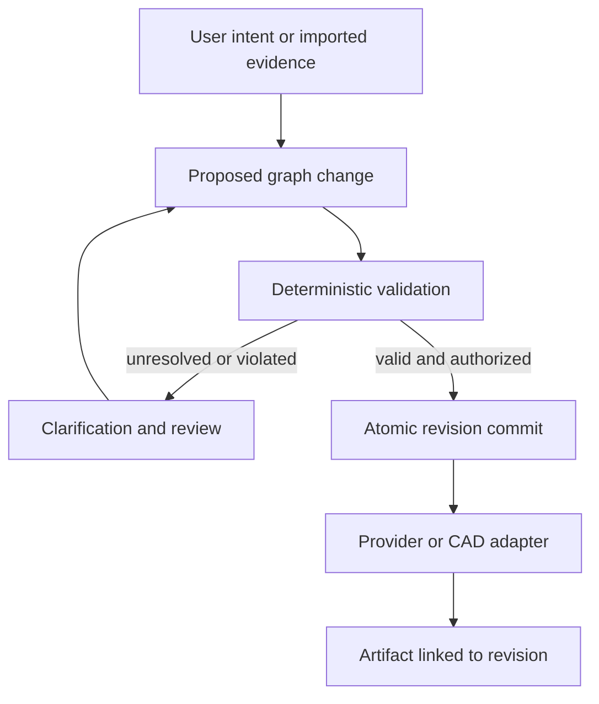

# Architecture

Status: Phase 1 foundation plus explicitly planned domain architecture.

## Dependency direction

The composition root in `api/app.py` wires infrastructure. HTTP and MCP are
independent inbound adapters that will call the same use cases. Neither is the
owner of architectural business rules.

| Package | Responsibility | Allowed project dependencies |
| --- | --- | --- |
| domain | Design Graph, value types, invariants, revision and provenance contracts | No infrastructure; deterministic geometry where required |
| geometry | Deterministic primitives and evaluators | No API, provider, database or model client |
| services | Use cases, orchestration, repository/provider protocols | domain, geometry |
| api | HTTP DTOs, validation, errors, identity translation | services; composition root wires adapters |
| mcp | Official SDK transport, tool schemas and annotations | services |
| providers | Model-specific request/response translation | services ports, domain value types |
| storage | Persistence mappings, repository and unit-of-work adapters | services ports, domain |

Pydantic may be used for validation at domain boundaries; FastAPI, MCP, SQLAlchemy,
OpenAI and HTTP client types must not appear in core domain signatures. Provider
errors are translated to stable application errors. Wire DTOs and domain entities
must not become SQL ORM models. `tests/test_architecture.py` guards core imports.

## Current runtime

`create_app()` validates settings and constructs routes without network calls.
The lifespan context sets up application logging and emits start/stop events.
Only `GET /api/v1/health` exists. Its immutable response declares schema `1.0`.
There is no readiness endpoint because no dependencies are yet wired.

Pure ASGI middleware generates a request ID and records method, status and
elapsed time. It excludes paths, queries, headers, bodies and project content.
Unhandled errors return a generic 500 with that ID. JSON logs include the exception
class, not its potentially sensitive message. Developers must log constant event
names and safe allowlisted metadata; the formatter is not a universal secret scrubber.
Uvicorn lifecycle logs retain its default format; application events are JSON.

Settings are explicit factory inputs or loaded once from the environment/.env.
They are immutable, testable and not stored in a global cached singleton. Logging
is process-scoped: multiple apps in one process share the application log level.
Run one service configuration per production process.

## Planned revision pipeline

A proposal carries the expected base revision, affected IDs, operation IDs,
source assertions and constraints. User authorization and validation are separate
requirements. Services call deterministic validation before a commit. No adapter
can mutate the canonical graph on its own. Generated material/geometry changes
return as proposals through the same pipeline.

## Persistence architecture (planned, not implemented)

Use a relational store first: SQLite for local development and PostgreSQL for
shared environments. SQLAlchemy 2 and Alembic are the selected future mapping
and migration approach, not active dependencies in Phase 1. Define repository
and unit-of-work protocols only after Phase 2 establishes actual domain contracts.

Planned tables: projects (tenant and head revision), immutable revisions
(schema version, canonical document, checksum, parent, actor), change records and
artifact metadata (revision link, provider/model/config versions, status, URI).
Store graph snapshots as portable JSON and normalize query-critical fields.
JSONB indexes may optimize PostgreSQL later without leaking into service ports.
Persist decimals as canonical strings in documents and exact numeric columns
where querying demands them. Never round-trip them through JSON floats.

Each revision commit is a transaction: conditional head update against the expected
revision, insert snapshot and audit data, commit together. A zero-row conditional
update is a conflict. Configure SQLite foreign keys explicitly and test transaction
semantics on both databases. SQLite passing does not certify PostgreSQL behavior.

Do not perform provider calls while holding database transactions. When asynchronous
jobs arrive, use a transactional outbox, durable worker state and idempotency keys.
Keep large binary artifacts outside SQL, with scoped metadata and integrity hashes.
Add tenant isolation, migrations and restore tests before exposing graph storage.

## Versioning and evolution

Service SemVer, HTTP major version, graph schema version, revision number and
provider model ID are separate identifiers. `/api/v1` evolves additively; breaking
wire changes require `/api/v2` and an announced compatibility window. Consumers
must tolerate documented additive response fields; requests reject unknown fields.

Graphs will declare an independent `schema_version`. Readers dispatch explicitly;
unknown major versions fail clearly. Pure upcasters migrate old snapshots into
current in-memory forms while preserving original documents and provenance.
No destructive automatic rewrite of history. Every supported old schema requires
fixtures and migration tests before a new schema ships. Phase 1 defines no graph
schema class and promises no untested graph migration.

## Model and tool adapters

Provider-neutral service ports will describe capabilities such as intent extraction,
image generation and artifact export. Do not force all providers into one lowest-
common-denominator generate method. Capability negotiation must reject unsupported
operations explicitly. Adapters own credentials, transport, timeouts, SDK objects,
schema translation, model IDs, rate limiting and billing metadata.

OpenAI Responses is the intended future orchestration API, following the official
migration guide. No API request code or model identifier is selected in Phase 1.
"GPT-6 Astra" is a requested product/model preference, not a verified API model ID.
Check account-visible official model support immediately before implementation.
The current ChatGPT plugin documentation and official MCP SDK guide are the future
host boundary; no old `ai-plugin.json` manifest is generated speculatively.

## Security and release gates

Local defaults bind to loopback. Before public deployment require authentication,
tenant isolation, TLS, host/origin policy, request limits and abuse protections.
For remote MCP use the current official authorization and transport guidance,
not caller-supplied tenant IDs or reused provider keys as access tokens.
Desktop adapters require explicit document identity, scoped paths, undo support,
operation approvals and permission checks. A provider prompt never grants authority.

CI must install from a resolved lock, build a wheel, run tests, formatting, strict
typing and HTTP smoke checks. Add a vulnerability/license scan and release threat
review when dependencies can be resolved. Phase 1 scaffolding alone is insufficient
evidence for a production deployment.
